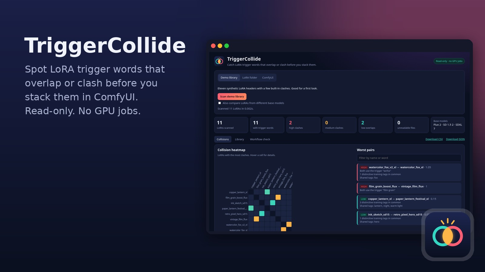

# TriggerCollide



Find LoRA trigger words that overlap or clash **before** you stack LoRAs in a ComfyUI workflow.
TriggerCollide reads only the small JSON header of each `.safetensors` file (or asks ComfyUI for it over
read-only GET requests), then shows which LoRAs share triggers, contain each other's triggers, or were trained
on each other's words, and which ones were trained on a different base model.

**It never queues anything.** TriggerCollide sends no `POST` requests to ComfyUI, never calls `/prompt` or the
queue, and cannot start a GPU job.

## Quick start

1. Download or clone this repo (`git clone https://github.com/grummpy/TriggerCollide`).
2. Double-click the launcher for your computer:
   - **Mac:** `Launch TriggerCollide.command` (first time: right-click → Open if macOS warns about an unidentified developer)
   - **Windows:** `Launch TriggerCollide.bat`
   - **Linux:** `launch.sh` (or install `triggercollide.desktop`)
3. The first run creates a private `.venv` and installs the pinned packages (about a minute). Later runs start in a second or two.
4. Your browser opens at `http://127.0.0.1:8741/`. Pick a source:
   - **Demo library**: 11 synthetic LoRA headers with planted clashes.
   - **LoRA folder**: for example `ComfyUI/models/loras`. Subfolders are included.
   - **ComfyUI**: your ComfyUI address, for example `http://192.168.x.x:8188` on your home network.

You need Python 3.11 or newer. If it is missing, the launcher says so and links to https://www.python.org/downloads/.

## What it checks

| Check | Example | Severity |
| --- | --- | --- |
| Exact trigger match | two LoRAs both trained on `wcfox` | high |
| Substring | `daiton` inside `daiton style` | medium to high |
| Shared words | `neon sign` and `blue neon sign` | low to medium |
| Trigger is another LoRA's training tag | your trigger `moonlit` is a caption tag in another LoRA | medium |
| Shared distinctive training tags | 11 uncommon tags in common | low |
| Base model mismatch | SDXL LoRA stacked on Flux | high (workflow check) |
| Total weight | strengths add up to 2.7 | medium above 1.5, high above 2.5 |

Where the trigger words come from, in order: a sidecar file next to the LoRA (`name.txt`, `name.json`,
`name.civitai.info` with `trainedWords`), `modelspec.trigger_phrase`, kohya dataset folder names
(`10_mytoken style` → `mytoken style`), and finally a guess from the most frequent training tag
(generic tags like `solo` are never guessed). Guessed triggers count for less.

The base model comes from the tensor layout when the whole header is available (Flux block names, SD3 joint
blocks, or the cross-attention width: 2048 = SDXL, 768 = SD 1.5, 1024 = SD 2). Otherwise it uses
`modelspec.architecture`, then `ss_base_model_version`. Some trainers write `sd_1.5` for Flux LoRAs, so that
value is ignored when the file says it came from ai-toolkit.

Tags that appear in the top list of 30% or more of your library (for example `1girl`) are treated as noise.
By default, LoRAs from different base models are not compared with each other, since they cannot be stacked.
Tick **Also compare LoRAs from different base models** to include them.

### Workflow check

Paste or upload a ComfyUI workflow (API format or the normal saved format). TriggerCollide finds `LoraLoader`,
`LoraLoaderModelOnly`, rgthree **Power Lora Loader**, Comfyroll **LoRA Stack** style nodes, and the checkpoint,
then flags clashes among the LoRAs actually stacked, base-model mismatches, LoRAs missing from the library,
strengths above 1.5, a high total weight, and triggers that are missing from the prompt. Bypassed or
muted nodes and switched-off entries are ignored. The workflow is never sent anywhere.

## Command line

```bash
.venv/bin/python -m triggercollide scan --folder ~/ComfyUI/models/loras --csv collisions.csv
.venv/bin/python -m triggercollide scan --comfy http://127.0.0.1:8188 --out scan.json
.venv/bin/python -m triggercollide scan --comfy http://127.0.0.1:8188 --counts-only   # no names or words
.venv/bin/python -m triggercollide check --folder ~/ComfyUI/models/loras --workflow my_workflow_api.json
```

`check` exits with code 1 when it finds a high-severity issue, so it can gate a script.

Optional: copy `config.example.toml` to `config.toml` (gitignored) to prefill your ComfyUI address or LoRA
folder, or set `TRIGGERCOLLIDE_COMFY_URL` / `TRIGGERCOLLIDE_LORA_FOLDER`.

## Developer setup

```bash
python3 -m venv .venv
.venv/bin/pip install -r requirements-dev.txt
.venv/bin/pip install -e . --no-deps
.venv/bin/python -m pytest
.venv/bin/ruff check .
python scripts/render_assets.py   # redraw the icons
```

Optional packaged app: `pip install pyinstaller && python scripts/build_app.py` on the OS you want a bundle for
(macOS uses `assets/icon.icns`, Windows `assets/icon.ico`). Not built in CI.

## Privacy

- The web UI binds to `127.0.0.1` only.
- Only safetensors headers are read; model weights are never loaded.
- ComfyUI is contacted only with `GET /system_stats`, `GET /models/loras` (or `/object_info/LoraLoader`) and
  `GET /view_metadata/loras?filename=...`. The client refuses any other path.
- Scan results live in memory and in files you choose to download. Nothing is uploaded.
- This repo contains synthetic demo data only. No real LoRA names or trigger words are committed.

## Validation

Validated on real data: the headers of 52 public LoRAs from 37 Hugging Face repos (SDXL, SD 1.5 and Flux,
kohya, ai-toolkit, diffusers and XLabs formats), scanned both as a folder and through a ComfyUI-style
read-only endpoint. All 52 were read without errors, every base model was identified from the tensor layout,
and the scan took about 0.15 s. It found real overlaps, such as two versions of one Flux LoRA that share a
trigger and two LoRAs from one author whose triggers contain each other.

## Limitations

- The macOS `.command` and Windows `.bat` launchers have not been run on a Mac or a Windows PC yet. The Linux launcher has.
- Through ComfyUI only the metadata is available, not the tensor layout, so LoRAs without metadata show
  **Unknown** base model (a local folder scan does not have this limit).
- Many LoRAs (especially diffusers and some Flux trainers) carry no trigger words in the file. Add a sidecar
  `.txt` with the trigger words next to them to include them in clash checks.
- Collision scores are heuristics. A high score means "test this pair together", not "this will break".
